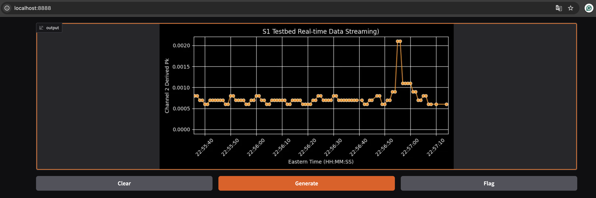

# logs & links /DIY
- https://viridian.ise.utk.edu:8000/user/xli27/lab/tree/projects/s1_demo_xl/
    - dev folder

# dockerization and work flow: /DIY

- ./docker_build_image_fe.sh
- ./docker_run_fe.sh
- http://localhost:8888/
    - image: 

# IDEA /Prod -> /Grafana_Suite
- Production mode
- Scalable & reliable solutions 
    - Grafana, InfluxDB

# log
- grafana published to viridian along with telegraf/mosquitto/mysql. 2/10/25
    - under the name `demo1` for now
    - requested name `grafana`
- local user added 
    - xli27@utk.edu `secret!99`
- add dashboard by id